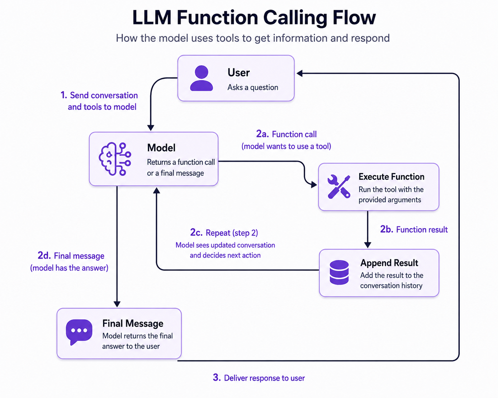

# 5. The Agentic Loop

This note extends [04-agentic-rag-function-calling.ipynb](04-agentic-rag-function-calling.ipynb). The previous notebook demonstrated one tool call: ask the model, execute `search`, return the result, and ask for the answer. This note explains what changes when the model wants to search more than once.

For hands-on practice, run [05-agentic-loop.ipynb](05-agentic-loop.ipynb). It follows this note in execution order and includes runnable experiments for typo recovery, multiple searches, off-topic scope, and safety controls.

## Why a loop is necessary

A single function call is not enough for questions that contain a typo, vague wording, or multiple information needs. We do not know in advance whether the model will need zero, one, or several tool calls.

The agentic loop repeats this cycle:



The model controls the next action. Our application controls execution, history, and safety limits.

## Anatomy of an agent

An agent has three practical parts:

1. **Instructions**: the developer message defines the role, scope, and expected behavior.
2. **Tools**: typed or schema-described functions the model can call.
3. **Memory**: the complete message history, including user input, model outputs, and tool results.

The model is stateless between API requests. The `messages` list is the memory that gives the next request continuity.

## A developer prompt that encourages recovery

A useful course-assistant instruction can tell the model to:

- use the search tool when it needs course information;
- use keywords from the question in its first search;
- inspect results and refine the query when the results are weak;
- answer only from the FAQ context;
- ask whether the learner wants to explore another course area.

Instructions influence behavior, but they are not a substitute for validation. The application should still enforce tool arguments, iteration limits, and access permissions.

```python
instructions = """
You're a course teaching assistant.
You're given a question from a course student and your task is to answer it.

If you need course information, use the search function.
Use keywords from the user's question in the first search.
Inspect the results and search again with new keywords when useful.
Answer only from the FAQ context.
At the end, ask whether the learner wants to explore another course area.
""".strip()
```

The prompt encourages recovery, but the model may still answer after one search. Prompt wording steers behavior; the loop and its limits enforce the application contract.

## The function-call helper

The helper performs the application-owned part of the loop:

```python
import json


def make_call(call):
    arguments = json.loads(call.arguments)

    if call.name == "search":
        result = search(**arguments)
    else:
        raise ValueError(f"Unknown tool: {call.name}")

    return {
        "type": "function_call_output",
        "call_id": call.call_id,
        "output": json.dumps(result, indent=2),
    }
```

The `call_id` is essential. It correlates the result with the exact function call that produced it. When several tools are returned in one model response, process each call and preserve each ID.

## Processing one response

After a response arrives:

1. append every item in `response.output` to the history;
2. inspect each item;
3. execute function calls and append their outputs;
4. remember whether at least one function call occurred;
5. call the model again only when the model requested a tool.

A text message with no function calls means the model has finished this turn.

The single-response processor can be written as a helper so the same behavior is used by both a one-off experiment and the full loop:

```python
def process_response(response, messages):
    messages.extend(response.output)
    has_function_calls = False
    last_answer = None

    for item in response.output:
        if item.type == "function_call":
            print("function_call:", item.name, item.arguments)
            messages.append(make_call(item))
            has_function_calls = True
        elif item.type == "message":
            last_answer = item.content[0].text
            print("ASSISTANT:")
            print(last_answer)

    return has_function_calls, last_answer
```

If `has_function_calls` is true, the history now contains tool output that the model has not seen yet, so the application sends it back in the next request.

## The reusable loop

A minimal implementation looks like this:

```python
def agent_loop(instructions, question, model="gpt-5.4-mini"):
    messages = [
        {"role": "developer", "content": instructions},
        {"role": "user", "content": question},
    ]

    for iteration in range(1, 6):
        print(f"iteration #{iteration}")
        response = openai_client.responses.create(
            model=model,
            input=messages,
            tools=[search_tool],
        )
        has_function_calls, last_answer = process_response(
            response, messages
        )

        if not has_function_calls:
            return last_answer

    raise RuntimeError("Agent stopped after reaching the iteration limit")
```

The maximum of five iterations is a safety boundary, not a requirement of the agent pattern. In production, also consider token budgets, request timeouts, tool timeouts, rate limits, and cancellation.

The important stopping rule is **no function calls in the current response**. The maximum iteration count is a second safety net that prevents an accidental or poorly instructed agent from running forever.

## Experiments to run

### 1. Typo recovery

Try:

```python
agent_loop(instructions, "How do I run Olama locally?")
```

Watch whether the first search is weak and a later search uses `Ollama`. This demonstrates why an agent can recover from a fixed pipeline's failed lexical match.

### 2. Multiple searches

Strengthen the instructions with: "First search, inspect the result, then search again with new keywords when useful." Compare the number of iterations and the final answer.

The model decides whether another search is worthwhile. We do not hard-code "search twice" because the correct number of searches depends on the question and the results. The loop makes the number of round trips dynamic.

### 3. Off-topic input

Try:

```python
agent_loop(instructions, "What is the queen's gambit?")
```

A course assistant should not answer from general knowledge when the FAQ does not support the question. This is a lightweight scope guardrail. Stronger systems validate the input before starting the loop and validate the final answer before returning it.

## Cost and observability

Each iteration is another model request. Later requests resend the growing history, tool definitions, and tool results. Track:

- iteration count;
- input and output tokens per response;
- total cost per user request;
- tool name and arguments;
- tool latency and errors;
- whether the loop stopped naturally or hit a limit.

A loop can improve recovery and answer quality while also increasing latency, cost, and behavioral variability.

## The implementation boundary

The model decides **what should happen next** by returning a tool call or a message. Your Python application decides **whether and how that action is allowed to happen**. Keep these responsibilities separate:

- validate the tool name and arguments before execution;
- catch tool errors and return safe error output to the model;
- restrict tools by user, tenant, or environment;
- cap iterations and total spending;
- log every tool call for debugging and evaluation.

The reusable implementation is also available in [agent_loop.py](agent_loop.py). The module accepts the client, tool schema, and search dispatcher as arguments so the loop remains independent of this project's specific index implementation.

## Checkpoint

Before moving to a framework, explain this sentence in your own words:

> The framework does not create the agent; it packages the message history, tool dispatch, repeated model calls, and stopping rules that we can already implement ourselves.

The next note compares that packaging layer and several production-oriented choices.
